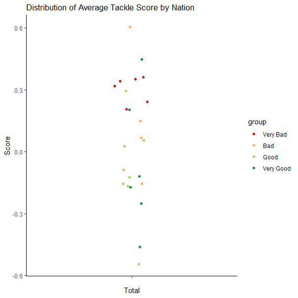

# Modelling the data

In order to construct the Rarita national team, TKGJ Consulting built a unique model which assigns each player an overall score, based on the aggregation of three key metrics. After determining which players performed best according to the culminated three metrics, judgement was employed to create a holistic approach to team selection. Weightings for each Index were assigned based on prioritising client needs, with Skill at 60% to ensure strong talent, Popularity at 30% to secure revenue and Wellbeing at 10% to encourage camaraderie.

## Skill metric

Performing this analysis, the statistics below were utilised across each skill area to create the weighted sums for each player's skill score.              
 Defense           | Passing       |Shooting          | Goalkeeping 
 ----------------- | ------------- |----------------- | -------------------
 Tackles Tkl       | Total Cmp     |Gls               | Playing Time MP
 Tackles TklW      | Total Att     |Standard Sh       | Playing Time Starts
 Tackles Def 3rd   | Total Cmp%    |Standard SoT      | Playing Time Min
 Tackles Mid 3rd   | Total TotDist |Standard SoT%     | Playing Time 90s
 Tackles Att 3rd   | Total PrgDist |Standard Sh/90    | Performance GA
 Vs Dribbles Tkl   | Short Cmp     |Standard SoT/90   | Performance GA90
 Vs Dribbles Att   | Short Att     |Standard G/Sh     | Performance SoTA
 Vs Dribbles Tkl%  | Short Cmp%    |Standard G/SoT    | Performance Saves
 Vs Dribbles Past  | Medium Cmp    |Standard Dist     | Performance Save%
 Pressures Press   | Medium Att    |Standard FK       | W
 Pressures Succ    | Medium Cmp%   |Performance PK    | D
 Pressures %       | Long Cmp      |Performance PKatt | L
 Pressures Def 3rd | Long Att      |Expected xG       | Performance CS
 Pressures Mid 3rd | Long Cmp%     |Expected npxG     | Performance CS%
 Pressures Att 3rd | Ast           |Expected npxG/Sh  | Performance PKatt
 Blocks Blocks     | xA            |Expected G-xG     | Penalty Kicks PKA
 Blocks Sh         | A-xA          |Expected np:G-xG  | Penalty Kicks PKsv
 Blocks ShSv       | KP            |                  | Penalty Kicks PKm
 Blocks Pass       | 1/3           |                  | Penalty Kicks Save%
 Int               | PPA           |                  | 
 Tkl+Int           | CrsPA         |                  | 
 Clr               | Prog          |                  | 
 Err               |               |                  | 
> The definitions of these of variables can be explored further [here](Data_Dictionary.xlsx).

Following visual analysis, there were attempts to perform ordinal logistic regression to create this weighted sum skill score approach. Ultimately, this provided mixed results due to these issues found in the visual analysis as it would penalise some good statistics as they would more commonly occur in worse teams. Additionally, the generalisation of a player's skill level based on their team performance would pose the problem of potential biases as worse players may be lucky in a good team or great players may be dragged down by their team's poor performance.

For the Skill Index, when determining the skill level for each player, a weighted sum approach was used that employed the normalised statistics provided. The coefficients varied for each skill's aspect (shooting, passing, defending, goalkeeping) and position. An additional weighted sum for a total skill score was then calculated to aggregate all data. The coefficients were calculated utilising actuarial judgement, that considered the value of the metric through research and exploratory analysis of the skills stronger teams possessed in the tournaments, e.g. highest weightings were applied to skill success rates; weaker weightings to less desirable features. Some weightings were also applied to metrics that did not necessarily indicate skill but expressed a desirable level of experience as this would prevent selection of players that might have excellent success rates but very low attempts, e.g. 100% tackle success rate but only 2 total tackles attempted. This modelling was used for each skill area with weightings assigned based on the relevance of the statistic for the player, e.g. it is more critical that a forward is making tackles in the attacking third rather than the defending third. Further, many variables were perfectly correlated with each other such as the total tackle count and counts of tackles within each third. Their coefficients were set to account for multi-collinearity. 
This approach was chosen as there were no distinct response variables that could be used to model player skill levels other than a team’s tournament performance. Once these scores were created for each skill aspect, they were then added together in an additional weighted sum based on the importance of that aspect for the position such as how forwards need excellent shooting unlike defenders. Players were then ranked by total skill component and its simplicity is valuable due to its allowance for future adjustments as new skills may become more relevant for other matches.

> The process for how the statistics were normalised and how the skill index was produced can be found [here](Modelling_Skill_Metric.R).

## Each additional metric

## Brainstorming

Ideas for further visuals: 
  Do this explanation as list summary?? 
  Create a table with each statistic as a row and each skill aspect as a column. 
  Maybe if we want to create something super duper simple to visually show what we mean? ie show an example player with high success but low experience and how we instead choose good performance and good experience (can show chosen with some highlight green effect) but feels like reaching?
  
   Future Outlook - Probably can just report but then tack on 1-2 sentences for further detail. 2-3 sentences that relate to the 'self-contained' portion of the marking criteria -- Potentially making direct references to ease of updating the models? Look into how other finish their github pages in general.

# Exploratory Data Analysis

## Player Data

Visual analysis was first utilised to explore the data and brainstorm potential methods for modelling the data. Initially visual scatterplots were used to determine the importance of variables by observing each player’s normalised score for a statistic and their team’s position in the global tournaments. This analysis showed no prominent patterns across most statistics and showed some biased patterns across defensive statistics such as number of tackles. A defender should be capable of making tackles but weaker teams are generally more likely to be on the defensive and will naturally make more tackles, making it seem like a player is worse for having made more tackles. Looking below, this example can be seen clearly:

# Limitations of Analysis
Exploring and analysing the data, there were a number of limitations encountered that restricted the level of analysis that could be performed. As such, this analysis utilised methods to reduce the effect of these problems but still suffered from a lack of potential. These limitations and their impacts are recorded below:

* Missing data for some teams resulting in a less comprehensive tournament results data exploration.
* Missing player data was imputed for modelling, therefore some player scores are only close to true scores.
* Lack of data recorded around physical traits that could be desirable such height
* Only two years of player statistics data is available, making it difficult to explore and build a reliable model
* Over-simplification of data due to aggregating statistics by season and not presenting statistics by game.
* Limited choices of modelling economic data such as an inability to construct time series due to a lack of years’ worth of data

# Future Outlook (Looking to add a bit more of a self-contained effect “case story, maybe some extra lines of overall thoughts in regard to the project?)

Through utilisation of these recommendations, Rarita should see large improvements in their national football performance, subsequently boosting their economy. This strategy utilised in this project was designed flexibly so that it can be adapted to any new problems or focus areas for team selection that arise. Additionally, new methods of modelling can explored over time that may be found to be more effective as new data is received (such as utilising time series in economic forecasting). Furthermore, the additional remnants of the budget can be allocated to areas such as further training to boost probabilities of winning or new exposure opportunities, compounding the positive effect of popularity on the economy. Thus, Rarita now has a comprehensive plan to establish a world-class football team and host a future World Cup which should reap substantial benefits to its economy.

