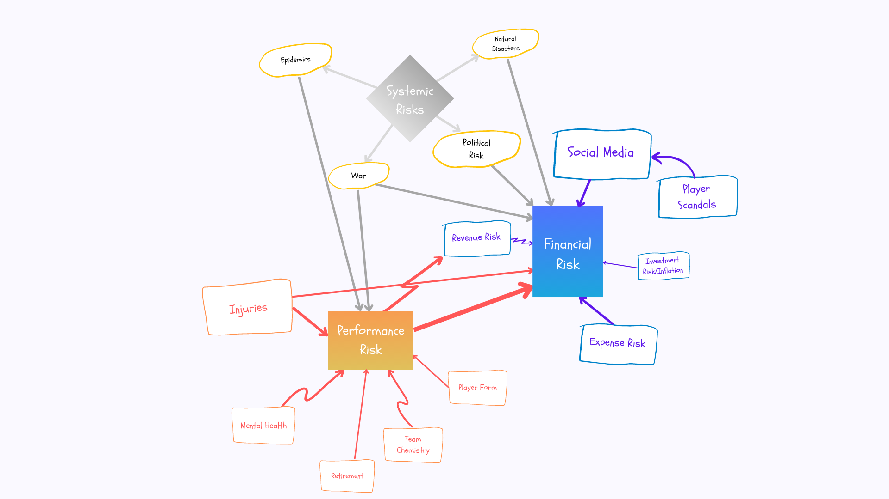

# Welcome to the TKGJ Consulting Repository, which explores the journey undertaken to select the new, successful Raritan Football team.
---

### To ensure the best competitive Raritan Team, TKGJ Consulting established a unique methodology to select the 25 players in the new national club. 
---
Extensive pre-modeling analysis allowed for preliminary insights and economic impact modeling assured the methodology employed assured financial success. An implementation plan is provided to ensure Rarita receives these benefits, including the choice of players for its national team. Finally, the repository concludes with risk management, ethical issues, and limitations.

# Table of Contents

1. [ Summary of Team Selection and Tournament Simulation ](#1)
1.1. [ Overview of Unique Methodology Employed ](#11)
1.2. [ Final Team Selection ](#12)
1.3. [ Tournament Simulation ](#13)
1.1. [ Overview of Unique Methodology Employed ](#11)
1.1. [ Overview of Unique Methodology Employed ](#11)

# 1. Summary of Team Selection and Tournament Simulation

### 1.1. Overview of Unique Methodology Employed

Three metrics (Skill, Popularity and Wellbeing) were constructed to measure player performance. The aggregated three indices were then used to assign players an overall score and the highest ranked players were easily identified. However, other qualitative factors needed to be considered to provide a holistic approach to team selection. As such, judgement was employed finally. Listed below is an overview of the qualitiative factors considered.

### 1.2. Final Team Selection

The 25 selected players, as listed below, assure success for the Raritan team, from both financial and tournament placement perspectives. 

Each player performed well within their respective indices, as demonstrated below.

The total cost of the chosen team was ∂431,118,000.

The number of goals per forward demonstrates promising results.

The chosen team represented a wide range of scores across all three indices.

Their respective Skill scores demonstrate diverse capabilities amongst Defence, Passing and Shooting.

There is an extensive range of ages within the team.

### 1.3. Tournament Simulation

To quantify Rarita’s success, a tournament simulation was designed. Averages of the chosen Rarita team’s Skill, Popularity and Wellbeing metrics were calculated, alongside those for other countries. This permitted comparison and thus the calculation of the Raritan expected rank to be 8.2. 

Rarita’s performance, in terms of the Indices, compared to all other nations is displayed below. Whilst average in terms of Popularity and Wellbeing, the chosen team boasts extraordinary Skill Scores.

# 2. Assumptions

When conducting analysis to both select the best possible team for Rarita and to evaluate the potential economic impacts, a number of assumptions had to be created to ensure reliable analysis. These assumptions are outlined below:
* The differences in data statistics between the totals and the sum of their segments is immaterial ranging between 1-2%.
* The data provided is valid for analysis and there is no further data of Rarita or player performance that can be utilised.
* A COVID-19 style pandemic existed in this hypothetical and the virus impacted Rarita.
* A nation's competitive ability can be found from their performance in the world tournament with the top six out of 24 being defined as very competitive.
* Rarita's national team must have at least six players from the nation of Rarita on the field at all times to eligible for competition due to the 6+5 rule commonly utilised by FIFA since 2008.

# 3. Pre-Modelling
---

> This section explores the SOA datasets and the relationship between a variety of variables. It also delves into the football players' relative statistics and attempts to deal with data irregularities. The corresponding Excel workbook can be downloaded [here](Pre-Modelling_and_Economic_Analysis.xlsx) and R file [here](insert R file here).

### 3.1. Exploratory Data Analysis

Key findings include:
* GDP per capita and population vary greatly by Rarita region.
* East Rarita represents a wealthier region with less people and higher average incomes while West Rarita is poorer and densely populated.
* Rarita suffered a recession in 2020 and a dip in birth rates, likely due to the COVID-19 pandemic.

> Per capita GDP and population growth rates can be found [here](https://raw.githubusercontent.com/ACTL4001-T1-2022/github-showcase-page-tkgj-consulting/main/GDP%20Growth%20Rates.jpg) and [here](https://github.com/ACTL4001-T1-2022/github-showcase-page-tkgj-consulting/blob/main/Population%20Growth%20Rates.png) respectively.

* Rarita's GDP growth averaged at 3.94% per year. This was around average when compared globally.

* The average inflation rate of Rarita was 3.51% per year.

* Average league attendance and social media followings is substantially lower in Rarita compared to other countries. Breakdown of social media following by country can be found [here](https://raw.githubusercontent.com/ACTL4001-T1-2022/github-showcase-page-tkgj-consulting/main/Social%20Media%20Graph.png)

* Annual GDP and revenue had a correlation coefficient of 0.43. Scatter Plot can be found [here](https://raw.githubusercontent.com/ACTL4001-T1-2022/github-showcase-page-tkgj-consulting/main/GDP%20Revenue%20Scatter.png).
* Social media followers and commercial revenue had a correlation coefficient of 0.82. Scatter Plot can be found [here](https://raw.githubusercontent.com/ACTL4001-T1-2022/github-showcase-page-tkgj-consulting/main/Social%20Media%20Commercial%20Scatter%20Plot.png).

* Raritan football profitability is quite low compared to various other nations.

* When assessing the number of players to select for each position (based off competitiveness of other nations), the optimal numbers were determined to be:
  * 2 goalkeepers
  * 8-9 defenders
  * 8 midfielders
  * 7 forwards
> A breakdown of how these optimal numbers were determined can be found [here](https://raw.githubusercontent.com/ACTL4001-T1-2022/github-showcase-page-tkgj-consulting/main/Optimal%20Player%20Numbers.JPG).

### 3.2. Data Cleaning

Imputation methods were required to correct eight datasets that were identified as having missing values. As demonstrated below, missingness plots were developed to ascertain this, with pink demonstrating the location of incomplete data. 

Tournament data had high percentages of missing values, shown through the following Missingness Maps.

League data represented lower percentages of missing values.

Multiple imputation methods were investigated and attempted. Some, such as the Amelia and MICE imputations, did not function well as they were not suited to the dataset, due to:
* Initial assumptions not aligning.
* They required character variables.
* Time taken to complete the imputation was inordinate. 

The KNN method was deemed most useful, due to appropriate run time and its examination of related values, meaning similar players, which aligns with the nature of the player data (Brownlee, 2020).

> Code used to assess the imputed variables is available [here](Imputation_Code). 
> The imputed data can be downloaded [here](TKGJ_Consulting_Data.xlsx). 

# 4. Modelling the data

In order to construct the Rarita national team, TKGJ Consulting built a unique model which assigns each player an overall score, based on the aggregation of three key metrics. After determining which players performed best according to the culminated three metrics, judgement was employed to create a holistic approach to team selection. Weightings for each Index were assigned based on prioritising client needs, with Skill at 60% to ensure strong talent, Popularity at 30% to secure revenue and Wellbeing at 10% to encourage camaraderie.

### 4.1. Skill Index

Performing this analysis, the statistics below were utilised across each skill area to create the weighted sums for each player's skill score.              
 Defense           | Passing       |Shooting          | Goalkeeping 
 ----------------- | ------------- |----------------- | -------------------
 Tackles Tkl       | Total Cmp     |Gls               | Playing Time MP
 Tackles TklW      | Total Att     |Standard Sh       | Playing Time Starts
 Tackles Def 3rd   | Total Cmp%    |Standard SoT      | Playing Time Min
 Tackles Mid 3rd   | Total TotDist |Standard SoT%     | Playing Time 90s
 Tackles Att 3rd   | Total PrgDist |Standard Sh/90    | Performance GA
 Vs Dribbles Tkl   | Short Cmp     |Standard SoT/90   | Performance GA90
 Vs Dribbles Att   | Short Att     |Standard G/Sh     | Performance SoTA
 Vs Dribbles Tkl%  | Short Cmp%    |Standard G/SoT    | Performance Saves
 Vs Dribbles Past  | Medium Cmp    |Standard Dist     | Performance Save%
 Pressures Press   | Medium Att    |Standard FK       | W
 Pressures Succ    | Medium Cmp%   |Performance PK    | D
 Pressures %       | Long Cmp      |Performance PKatt | L
 Pressures Def 3rd | Long Att      |Expected xG       | Performance CS
 Pressures Mid 3rd | Long Cmp%     |Expected npxG     | Performance CS%
 Pressures Att 3rd | Ast           |Expected npxG/Sh  | Performance PKatt
 Blocks Blocks     | xA            |Expected G-xG     | Penalty Kicks PKA
 Blocks Sh         | A-xA          |Expected np:G-xG  | Penalty Kicks PKsv
 Blocks ShSv       | KP            |                  | Penalty Kicks PKm
 Blocks Pass       | 1/3           |                  | Penalty Kicks Save%
 Int               | PPA           |                  | 
 Tkl+Int           | CrsPA         |                  | 
 Clr               | Prog          |                  | 
 Err               |               |                  | 
> The definitions of these of variables can be explored further [here](Data_Dictionary.xlsx).

Initially modelling the Skill Index, there were attempts to perform ordinal logistic regression to create this weighted sum skill score approach. Ultimately, this provided mixed results due to these issues found in the visual analysis as it would penalise some good statistics as they would more commonly occur in worse teams. Additionally, the generalisation of a player's skill level based on their team performance would pose the problem of potential biases as worse players may be lucky in a good team or great players may be dragged down by their team's poor performance.

Following the attempts above, a weighted sum approach that employed the normalised statistics provided was finally chosen to model a player's skill. The coefficients varied for each skill's aspect (shooting, passing, defending, goalkeeping) and position. An additional weighted sum for a total skill score was then calculated to aggregate all data. The coefficients were calculated utilising actuarial judgement, that considered the value of the metric through research and exploratory analysis of the skills stronger teams possessed in the tournaments, e.g. highest weightings were applied to skill success rates; weaker weightings to less desirable features. Some weightings were also applied to metrics that did not necessarily indicate skill but expressed a desirable level of experience as this would prevent selection of players that might have excellent success rates but very low attempts. While someone with low experience may be good, their perfomance may have only been the result of versing worse players or encountering luckir scenarios and would not be able to maintain this performance in the world tournament.

> The table highlights this importance of experience as a pure success rate based metric would select Player 1 but with an experience weighting, it would select Player 2.

This modelling was used for each skill area with weightings assigned based on the relevance of the statistic for the player, e.g. it is more critical that a forward is making tackles in the attacking third rather than the defending third. Further, many variables were perfectly correlated with each other such as the total tackle count and counts of tackles within each third. Their coefficients were set to account for multi-collinearity. 

> The flowchart above showcases the relationship between statistics since tackles in a specific 3rd is just a subset of total tackles, counting both statistics would lead to double counting and accidentally over-emphasising the importance of tackles in defensive statistics.

This approach was chosen as there were no distinct response variables that could be used to model player skill levels other than a team’s tournament performance. Once these scores were created for each skill aspect, they were then added together in an additional weighted sum based on the importance of that aspect for the position such as how forwards need excellent shooting unlike defenders. Players were then ranked by total skill component and its simplicity is valuable due to its allowance for future adjustments as new skills may become more relevant for other matches.

> The process for how the statistics were normalised and how the skill index was produced can be found [here](Modelling_Skill_Metric.R).

### 4.2. Popularity Index

The second metric used, named the Popularity Index, evaluated how famous the player was on the world stage, which is crucial to increase awareness and thus revenue of the Rarita team. The below table lists all factors considered. 

Once relevant data was found and divided by player, everyone was ranked according to the separate factors. These ranks were then standardised by their mean and population standard deviation. Country data was assigned to players of that nation, e.g. Nganion players have equivalent social media scores. Finally, the average of all the standardised scores was taken, resulting in the final Popularity Index. 
> The following Excel workbook contains detailed analysis of the Popularity Index, dowloadable [here](TKGJ_Consulting_Team_Modeling_of_Indices_and_Selection.xlsx). Relevant data can be downloaded [here](TKGJ_Consulting_Data.xlsx). 

### 4.3. Wellbeing Index

Wellbeing was the third key metric applied. Ensuring camaraderie amongst players is crucial when creating a positive team culture, as individuals can perform better when they genuinely enjoy themselves, trust others and are supported through their own personal and professional growth. The Wellbeing Index was designed to indicate the player’s likelihood of positively contributing to the team’s morale, with all factors listed below. 

Similar methodology as the Popularity Index was then applied, in terms of rankings and standardisation. 
> The following Excel workbook contains detailed analysis of the Wellbeing Index, dowloadable [here](TKGJ_Consulting_Team_Modeling_of_Indices_and_Selection.xlsx). Relevant data can be downloaded [here](TKGJ_Consulting_Data.xlsx). 

# 5. Economic Impact
---

> This section outlines how Rarita Football's revenues and expenses were forecasted through an analysis of economic trends and modelling of different types of revenue. The corresponding Excel workbook can be downloaded [here](https://github.com/ACTL4001-T1-2022/github-showcase-page-tkgj-consulting/blob/main/Pre-Modelling%20and%20Economic%20Analysis.xlsx).

### 5.1. Economic and Population Trends
The limited years of economic data available for the regions of Rarita meant that medium-term sample means were taken to forecast the corresponding economic variables. It was assumed over the next 10 years that the economy would behave in line with these averages.

### 5.2. Forecasting Revenue and Expenses Over the Next 10 Years
Two processes of forecasting the cash flows were considered:
* A naive model which assumed per capital total revenue growth would follow some function of GDP per capita growth and that expenses would grow at its previous 5 year average.
* A comprehensive model that forecasted per capita commercial, matchday and broadcast revenue seperately and that expenses would grow at its previous 5 year average.
>Both models assumed that the populations of each region of Rarita would continue to grow at their 10 year average growth rates. The tolerance for these models were p-values of 0.1 or less when considering statistical significance, which both models comfortably passed.
#### Naive Model
The naive model utilised simple linear regression with the dependent variable being per capital total revenue and the sole independent variable being GDP per capita. The justification for this was that as an economy grows, incomes will grow and will allow individuals to spend more money on leisure related goods, including those related to Raritan football. GDP growth was assumed to grow at a constant 3.94% per year as outlined aboved.

Expense growth was assumed to grow at its 5 year average of 6.9%. The above results were combined to first forecast GDP per capita from 2021-2030 and then substitute these values into the simple linear regression model to forecast total revenue per capita. Total expenses per capita were also forecasted and both these figures were then multiplied by the projected population for that particular year to get total revenue and expenses.

> A more detailed breakdown can be found [here](https://raw.githubusercontent.com/ACTL4001-T1-2022/github-showcase-page-tkgj-consulting/main/Naive%20Model%20Forecast.jpg)

As seen above, the projected net present value of all future cash flows is a profit of 6.43 billion doubloons.

#### Comprehensive Model
The comprehensive model utilised several simple linear regression models to assist in forecasting per capita matchday and commercial revenue. It also considered Rarita's football rank as a factor affecting revenue. Broadcast revenue was assumed to grow in line with its previous 5 year average of 4.2% annually and expense growth was once again assumed to remain at 6.9% per year. 

The strong relationship between social media following and a nation's football rank was explored through a simple linear regression model. The intuition behind this was that stronger performance would create more fans who would likely use social media (especially younger generations).

The above model was utilised to predict commercial revenue by then regressing per capita commercial revenue on social media following. The intuition was that one would expect that a strong online following would entice companies to sponsor Raritan football and also experience a rise in merchandise sales.

>Using the projected Raritan football ranking of 8.2, commercial revenue was able to be forecasted (see below).

Per capita matchday revenue (revenue from ticket sales) was also assumed to be influenced by rank, as a stronger football nation is likely to have a higher quality league and a more attractive playstyle with popular players competing. 

>Using the projected Raritan football ranking of 8.2, matchday revenue was able to be forecasted (see below).

These projections were combined alongside the assumptions regarding broadcast and expense growth outlined above to forecast profit (by multiplying per capita revenues/expenses by the same projected populations from the naive model)

> A more detailed breakdown of [commercial](https://raw.githubusercontent.com/ACTL4001-T1-2022/github-showcase-page-tkgj-consulting/main/Comprehensive%20Model%20Commercial%20Revenue%20Forecast.jpg), [matchday](https://raw.githubusercontent.com/ACTL4001-T1-2022/github-showcase-page-tkgj-consulting/main/Comprehensive%20Model%20Matchday%20Revenue%20Forecast.jpg) and [broadcast](https://raw.githubusercontent.com/ACTL4001-T1-2022/github-showcase-page-tkgj-consulting/main/Comprehensive%20Model%20Broadcast%20Revenue%20Forecast.jpg) revenues and a total revenue/expense breakdown can be found [here](https://github.com/ACTL4001-T1-2022/github-showcase-page-tkgj-consulting/blob/main/Comprehensive%20Model%20Forecast.jpg)

As seen above, the projected net present value of all future cash flows is a profit of 5.14 billion doubloons.

> The comprehensive model's forecasts were used when considering financial decisions in the implementation plan.

Explosive increases in per capita matchday and commercial revenue following Rarita's projected success of attaining a rank of 8.2 are the main drivers of the 5.14 billion profit figure. In terms of economic impact, the following three industries will be most impacted:
* Sport: the improvement of Rarita’s football ranking is expected to increase general interest in football and act as a source of inspiration for younger generations. In countries where football is extremely popular, such as England, football has contributed over 100,000 jobs and ∂3.4 billion to GDP
* Construction: the building of new training facilities and stadiums (discussed in implementation plan) will require tradesmen, engineers and architects alongside managers
* Tourism: 2.9 million foreign tourists visited Russia for their 2018 World Cup and similar numbers could be expected should Rarita successfully bid for the hosting of a future tournament. Their presence would indirectly impact other industries such as food, accommodation, transport etc 

In terms of impact on Rarita’s provinces, it is likely that growth in the above industries will lead to GDP and income growth. Studies have also shown that growth in football has a positive social impact on crime figures, with an SROI model estimating that an individual who is likely to commit a crime will see a 15% reduction in this likelihood if they play football. This is especially likely to impact the Western Rarita province which has a lower income level but higher population density, a combination that generally leads to high crime rates. Targeted scholarship programs for underprivileged children to attend training facilities will also be utilised in the Central and Western Rarita regions to help bridge the gap with the wealthier East. 

# 6. Implementation Plan

The future profits from Raritan football alongside the initial grant allowed for a 10 year implementation plan to be established. The use of the finances include but are not limited to:
* Marketing
* Training facility
* Stadiums
* Scholarships
* General preparation for hosting the World Cup

# 7. Risks and Ethical Considerations

Below is a brainstorm used to identify events that could potentially affect the results of the team. The major risks discussed in the report were performance risk, expense risk, social media, player scandals and player injuries.

Sensitivity analysis was performed by changing various assumptions and is available [here](https://raw.githubusercontent.com/ACTL4001-T1-2022/github-showcase-page-tkgj-consulting/main/Sensitivity.JPG) by one percentage point and by one standard deviation and seeing the resulting impact on projected profit.

For the ethics section, each recommendation was considered according to how they would affect the main stakeholders. The first two in the table below were discussed in the report as they were the most in need of justification.

# 8. Limitations of Analysis
Exploring and analysing the data, there were a number of limitations encountered that restricted the level of analysis that could be performed. As such, this analysis utilised methods to reduce the effect of these problems but still suffered from a lack of potential. These limitations and their impacts are recorded below:

# 9. Future Outlook
Through utilisation of these recommendations, Rarita should see large improvements in their national football performance, subsequently boosting their economy. This strategy utilised in this project was designed flexibly so that it can be adapted to any new problems or focus areas for team selection that arise. Additionally, new methods of modelling can explored over time that may be found to be more effective as new data is received (such as utilising time series in economic forecasting). Furthermore, the additional remnants of the budget can be allocated to areas such as further training to boost probabilities of winning or new exposure opportunities, compounding the positive effect of popularity on the economy. Thus, Rarita now has a comprehensive plan to establish a world-class football team and host a future World Cup which should reap substantial benefits to its economy.

# 10. Reference List

Aitken, A. (2020). “Measuring Welfare Beyond GDP” in National Institute Economic Review, vol. 249, no.1, pp.3-16, doi: https://doi.org/10.1177/002795011924900110 

Ayamga, E. (2019). The 10 most expensive football training grounds in the world. SportsZion.
https://www.sportszion.com/10-most-expensive-football-training-grounds/ 

Ballong, S. (2010). The cost of a World Cup. The Africa Report.
https://www.theafricareport.com/9087/the-cost-of-a-world-cup/ 

Brownlee, J. (2020). kNN Imputation for Missing Values in Machine Learning. Machine Learning Mastery.
https://machinelearningmastery.com/knn-imputation-for-missing-values-in-machine-learning/?fbclid=IwAR07xyP-FFLhNS-UvQejzSeomQzPR_u3zgQCnkZ81LlwaxM6ai0C60q-PKI 

Ernst & Young LLP. (2015). The economic impact of the Premier League. SportsThinkTank. 
https://www.sportsthinktank.com/uploads/ey-the-economic-impact-of-the-premier-league.pdf 

Killingsworth, M. (2021), “Experienced well-being rises with income, even above $75,000 per year” in Proceedings of the National Academy of Sciences, vol. 118, 2021, doi: https://doi.org/10.1073/pnas.2016976118 

Oulton, N. (2012). Hooray for GDP! GDP as a measure of wellbeing. VoxEU.
https://voxeu.org/article/defence-gdp-measure-wellbeing?fbclid=IwAR2tKWkkn22DdFWCtrx4PMqsDctWNJuVOJUhgf8Ks6oNcdoed2EGyAlHzN8#:~:text=GDP%20is%20also%20an%20indicator,with%20infant%20mortality%20and%20inequality 

Sartori, A & Nienhoff H. (2013). A Blueprint for Successful Stadium Development. KPMG.
https://assets.kpmg/content/dam/kpmg/pdf/2013/11/blueprint-successful-stadium-development.pdf 

Tyrin, E. (2018). More than 5 million tourists visit FIFA World Cup host cities in Russia. TASS Russian News Agency.
https://tass.com/sport/1012057?utm_source=google.com&utm_medium=organic&utm_campaign=google.com&utm_referrer=google.com 

