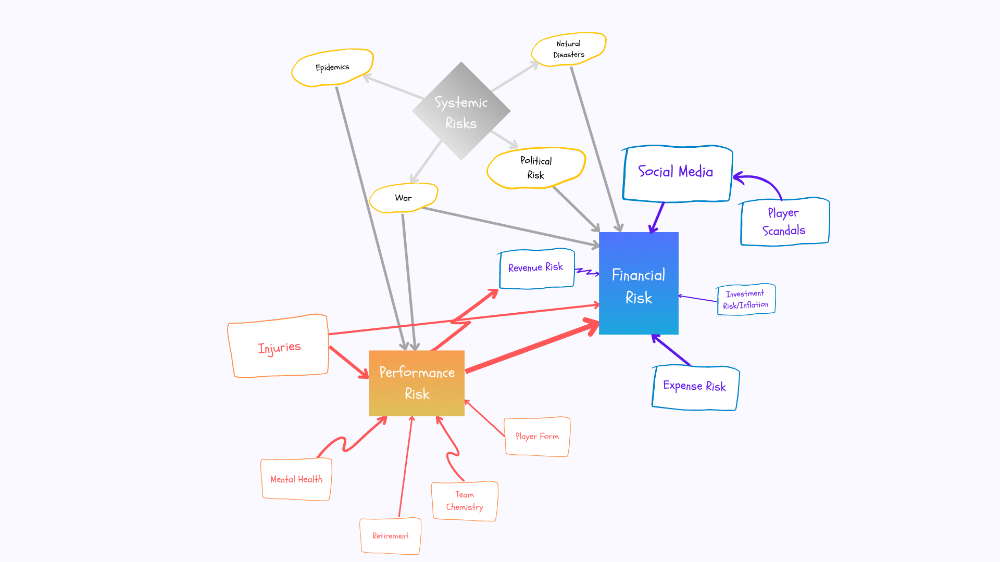

# Risks and Ethical Considerations

Below is a brainstorm used to identify events that could potentially affect the results of the team. The major risks discussed in the report were performance risk, expense risk, social media, player scandals and player injuries.

Sensitivity analysis was performed by changing various assumptions and is available [here](https://raw.githubusercontent.com/ACTL4001-T1-2022/github-showcase-page-tkgj-consulting/main/Sensitivity.JPG) by one percentage point and by one standard deviation and seeing the resulting impact on projected profit.

### Ethics
For the ethics section, each recommendation was considered according to how they would affect the main stakeholders. The first two in the table below were discussed in the report as they were the most in need of justification.

